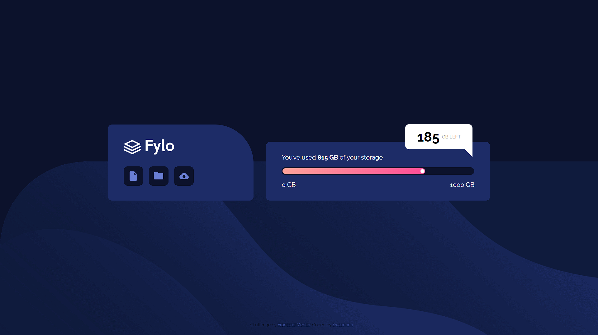
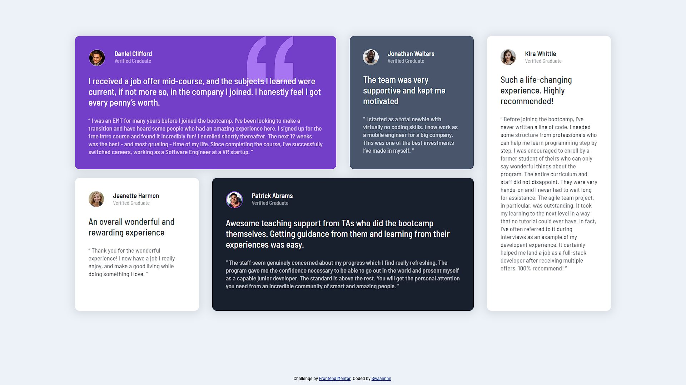
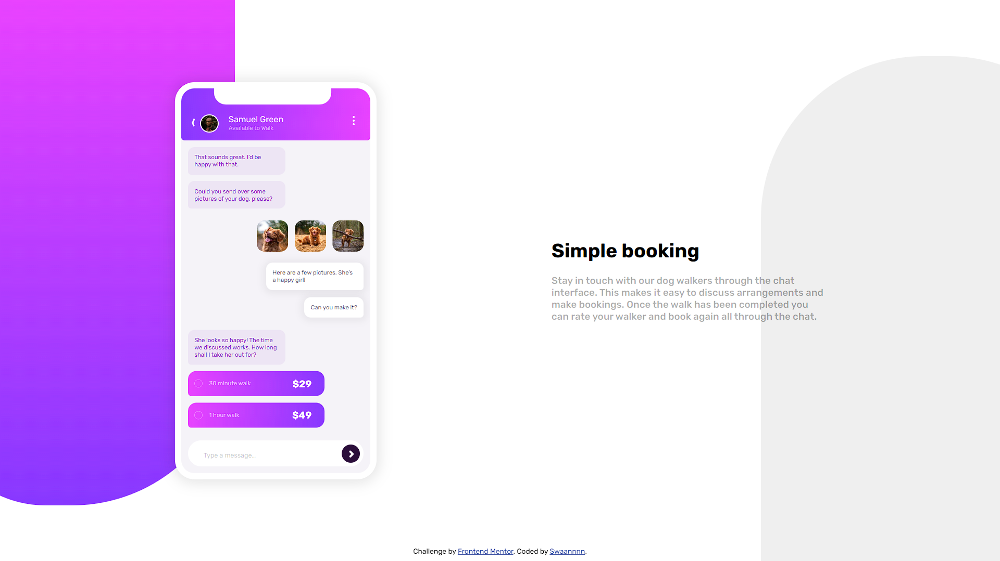

# Frontend Mentor

Voici différentes implémetations que j'ai réalisé depuis le site [Frontend Mentor](https://www.frontendmentor.io/) ainsi que leurs dépôts GitHub respectifs

- [Fylo data storage component](https://github.com/Swaannnn/Fylo-data-storage-component)

- [Testimonials grid section](https://github.com/Swaannnn/Testimonials-grid-section)

- [Chat-app CSS illustration](https://github.com/Swaannnn/Chat-app-CSS-illustration)

